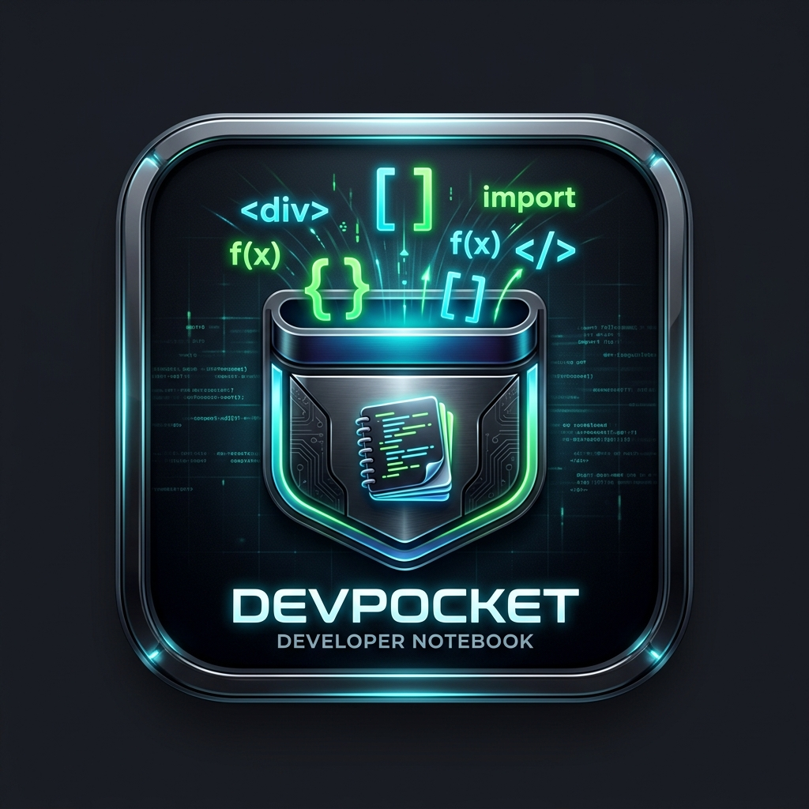

# DevPocket 🎒
> **The Ultimate Developer Note-Taking, Task & Kanban Management Desktop Application.**



**DevPocket** is a powerful, offline-first desktop application designed specifically for developers, software engineers, and technical creators. It combines hierarchical note-taking, Kanban task board tracking, audio note recording with speech recognition, automated Git backup/synchronization, and full RTL Arabic/English localization into a sleek, dark-themed user experience.

---

## ✨ Features

- 📁 **Categorized Notes Management:** Organize notes by project categories, complete with Markdown rendering, tags, and attachment support.
- 📋 **Kanban Task Board:** Visualize task progress (To Do, In Progress, Done) with drag-and-drop / single-click state transitions.
- 🎙️ **Voice Recording & Speech Recognition:** Record voice notes and automatically transcribe them to text (supports Arabic & English).
- 🌙 **Modern Dark Theme:** Premium, high-contrast dark aesthetic tailored for long developer sessions.
- 🌐 **RTL & Bilingual Support:** Native Arabic & English interface support out of the box.
- 🔄 **Git Backup & Sync:** Automatically commit and sync your notes to any remote Git repository.
- 📦 **Windows Portable Mode:** Includes a zero-dependency standalone build for Windows (runs without installing Python).

---

## 🚀 Quick Start (Running from Source)

### 📋 Prerequisites

- **Python 3.8+** installed on your system.
- **Git** installed on your system.

---

### 🐧 Linux & 🍎 macOS

1. **Clone the repository:**
   ```bash
   git clone <YOUR_GITHUB_REPO_URL>
   cd DevPocket
   ```

2. **Install dependencies:**
   ```bash
   pip3 install -r requirements.txt
   ```

3. **Run DevPocket:**
   ```bash
   python3 DevPocket.py
   ```

---

### 💻 Windows (Command Prompt / PowerShell)

1. **Clone the repository:**
   ```cmd
   git clone <YOUR_GITHUB_REPO_URL>
   cd DevPocket
   ```

2. **Install dependencies:**
   ```cmd
   pip install -r requirements.txt
   ```

3. **Run DevPocket:**
   ```cmd
   python DevPocket.py
   ```
   *(or double-click `DevPocket.bat` to launch and automatically create a Desktop shortcut!)*

---

## ⚡ Windows Standalone / Portable Mode (No Python Needed)

For Windows users who do **not** have Python installed:

1. Download **`DevPocket_Windows_Standalone.zip`** from the [Releases page](https://github.com).
2. Extract the ZIP archive to any folder.
3. Double-click **`DevPocket.bat`** inside `DevPocket_Windows_Portable/`.
   - On first run, it automatically creates a `DevPocket` shortcut on your Desktop with the official app icon!

---

## 🛠️ Required Dependencies (`requirements.txt`)

```text
PyQt5>=5.15.0
PyYAML>=6.0
markdown>=3.4
pymdown-extensions>=10.0
emoji>=2.0.0
requests>=2.28.0
GitPython>=3.1.0
SpeechRecognition>=3.10.0
```

---

## 📂 Project Structure

```text
DevPocket/
├── DevPocket.py           # Application Entry Point
├── DevPocket.bat          # Windows Launcher Script (Auto Desktop Shortcut)
├── app_icon.png           # Application GUI Icon (PNG)
├── app_icon.ico           # Application Desktop Icon (ICO)
├── requirements.txt       # Python Dependencies List
├── README.md              # Project Documentation
├── modules/               # Core Application Logic & UI Screens
│   ├── ui_categories.py   # Main Dashboard & Categories Window
│   ├── ui_create_note.py  # Note Creation & Editing Dialog
│   ├── ui_list_notes.py   # Notes List & Table View
│   ├── ui_view_note.py   # Note Viewing Dialog
│   ├── ui_kanban.py       # Kanban Task Board Window
│   ├── ui_reminders.py    # Reminders Dialog
│   ├── voice_recorder.py  # Audio Recorder & Speech-to-Text
│   ├── note_manager.py    # Notes File Storage Manager
│   ├── git_sync.py        # Git Sync & Repository Manager
│   ├── theme.py           # Application Dark Theme QSS
│   └── i18n.py            # Localization (Arabic/English)
└── notes/                 # User Data & Storage Directory
```

---

## 📜 License

Distributed under the MIT License. See `LICENSE` for more information.
